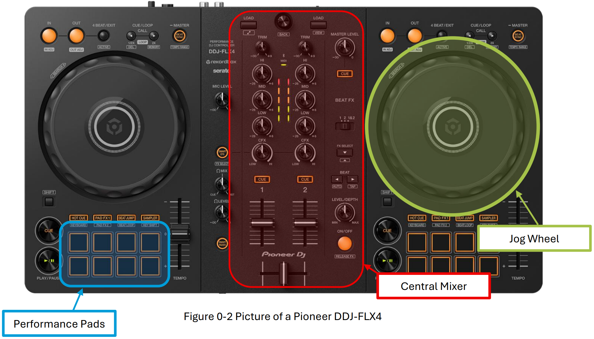

# About

## What is a DJ Controller?

A Controller refers to an all-in-one piece of equipment. Typically combines two or more virtual “decks”
with the jog-wheels and a central mixer section. These decks have songs loaded in them for playback.
Usually includes built-in Performance pads and basic effects controls. For most use cases, it functions
as a near complete general solution for mixing and manipulating tracks.

## Why the Pioneer DDJ-FLX4

The Pioneer DDJ-FLX4 is one of the more common and popular DJ controller board out there. It is capable
of achieving the majority of the requirements of a DJ and is also recommended for beginners too.

The workflow and usage of this Controller is similar to other Controllers on the market, reducing any
required onboarding. It comes with Jog wheels for scratching of songs. It comes with performance pads
which we can use for setting up “Hot cues” (points that we can jump to in our song) and play other audio
samples, and more. Using those same pads, we can also temporarily apply various audio effects for as
long as we have the buttons activated for. 

Thankfully there exists numerous resources out there about [how this board works exactly](https://support.alphatheta.com/en-US/articles/12267724407961?product=12077079532697).